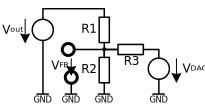

# Digital adjusted regulator output

## Keywords
Voltage regulator, supply, PWM/DAC controlled output, calculation formula

## Abstract
In some cases is a digital controllable output voltages of a VFB or VREF input regulator desirable. The calculation and dimensioning of the feedback network is described in this article.

## Topology

 

 

## Dimensioning

## Derivation

The voltage regulator can rewritten in a equivalent voltage sources circuit as follows:

 

To allow the calculation of the circuit is the substitution of the voltage sources mandatory. Rewritten with current sources:

 

Replace the resistance by conductance:

Convert voltage sources to corresponding current sources:

All conductances assigned to VFB follows with Kirchhoff's current law:

Current sources back transformed to voltage sources and the basic formula is ready:

https://latex.codecogs.com/svg.latex?

## Used Tools

